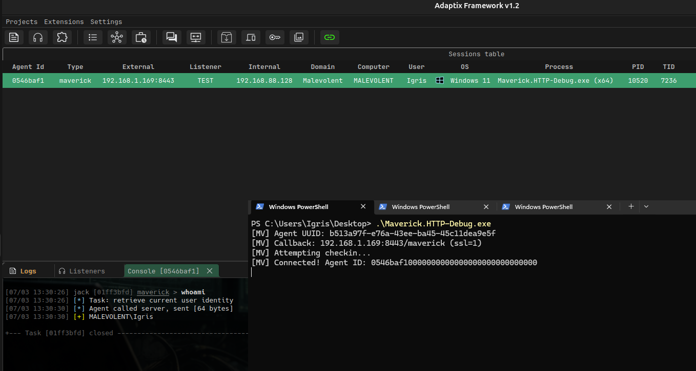

# Maverick

<p align="center">
  
</p>

An Adaptix C2 agent built with Crystal Palace — a custom PIC (Position Independent Code) linker and PICO module system. Demonstrates how to build modular shellcode agents where each component (transport, tasks, obfuscation) is a separate PICO blob loaded at runtime.

## Note

This agent does not include any evasion techniques and is not meant to be used as-is in engagements. It is a reference implementation for building agents with Crystal Palace and the PICO module system.

## Crystal Palace & PICO System

**Crystal Palace** is a PIC linker that takes compiled COFF objects and produces position-independent executables. Key concepts:

- **Core PIC** (`make pic +gofirst`) — The main executable shellcode. Contains the bootstrap code, DFR resolver, and section markers where PICO modules get linked. Called directly by the loader.
- **PICO Modules** (`make object`) — Self-contained code blobs with their own code and data sections. Loaded at runtime via `PicoLoad()` from libtcg. Each PICO has an entry point (`go()`) callable via function pointer.
- **DFR (Dynamic Function Resolution)** — Crystal Palace replaces `MODULE$Function` syntax (e.g. `KERNEL32$VirtualAlloc`) with calls to `resolve(mod_hash, func_hash)` using ROR13 hashing. No import table. All string arguments (DLL names, function names) are built on the stack as char arrays to avoid plaintext in the binary.
- **Section Linking** — PICO blobs are embedded into the Core PIC at named sections (`entry_module`, `transport_module`, etc.) via the `link` directive in the `.spec` file.
- **IMPORTFUNCS** — Crystal Palace struct `{LoadLibraryA, GetProcAddress}` passed to `PicoLoad()` so PICO modules can resolve their own DFR symbols.

### Build Pipeline

```
C source → mingw-gcc → COFF objects → Crystal Palace link → raw PIC shellcode → loader (Exe/Dll/Svc)
```

### agent.spec

The `.spec` file defines how Crystal Palace links everything:

```
x64:
    load "Bin/obj/main.x64.o"           # Core PIC
        make pic +gofirst
        foreach %LIBS: mergelib %_       # Merge libtcg
        load "Bin/obj/entry.x64.o"       # Entry PICO
            make object
            load "Bin/obj/crypto.x64.o"  #   merge crypto into entry
                merge
            load "Bin/obj/packer.x64.o"  #   merge packer into entry
                merge
            export
            link "entry_module"          #   link at section marker
        load "Bin/obj/transport.x64.o"   # Transport PICO
            make object
            mergelib "lib/LibWinHttp/..."
            export
            link "transport_module"
        ...                              # task_module, obfuscation_module
        dfr "resolve" "ror13"            # resolve all DFR symbols
        export
```

## Architecture

```
Core PIC (main.c)
  │
  ├── resolve()              DFR bridge → libtcg hash lookup
  ├── AllocateAndLoadModule() PicoLoad each PICO into shared RWX region
  │
  └── calls entry module go() with pointers to all other modules
        │
        ├── Entry Module (entry.c)
        │     MvState, checkin, transact (RC4 wire format), task loop
        │
        ├── Transport Module (transport.c)
        │     HTTP/HTTPS POST via LibWinHttp
        │
        ├── Task Module (tasks.c)
        │     Command dispatch: whoami (0x30), sleep (0x20), exit (0x10)
        │
        └── Obfuscation Module (obfuscation.c)
              Ekko sleep — timer-queue ROP chain that encrypts module memory
              with RC4 (SystemFunction033) during sleep, decrypts on wake
```

### Memory Layout at Runtime

```
┌─────────────────────────────┐
│ Shared RWX Region           │  VirtualAlloc(PAGE_EXECUTE_READWRITE)
│  ├── Entry code             │  PicoLoad → code here
│  ├── Transport code         │
│  ├── Task code              │
│  └── Obfuscation code       │
├─────────────────────────────┤
│ Entry data (RW)             │  PicoLoad → data here (separate alloc)
│ Transport data (RW)         │
│ Task data (RW)              │
│ Obfuscation data (RW)       │
├─────────────────────────────┤
│ Core PIC (freed after boot) │  Original shellcode, freed by entry module
└─────────────────────────────┘
```

The shared RWX region is what Ekko encrypts/decrypts during sleep cycles.

## Wire Format

All traffic is encrypted with RC4 (stream cipher, 16-byte key).

```
Send:    [36B agent_id][RC4(payload)][16B key (first checkin only)]
Receive: [36B agent_id][RC4(response)]
```

## Source Files

```
src_beacon/Source/
├── main.c           Core PIC — DFR resolver, module loading, bootstrap
├── entry.c          Entry PICO — agent state, checkin, task loop, transact
├── transport.c      Transport PICO — HTTP POST via LibWinHttp
├── tasks.c          Task PICO — whoami/sleep/exit dispatch
├── obfuscation.c    Obfuscation PICO — Ekko sleep (timer-queue ROP + RC4)
├── crypto.c         RC4 stream cipher (merged into entry PICO)
├── packer.c         Binary packer BE / parser LE (merged into entry PICO)
└── includes/
    ├── config.h     Build-time defines (UUID, sleep, callback host/port/uri/ssl)
    ├── crypto.h     RC4 API
    ├── packer.h     PackBuf / Parser API
    ├── tcg.h        Crystal Palace libtcg (PicoLoad, findModuleByHash, etc.)
    └── HTTP.h       LibWinHttp API
```

## Commands

| Command | ID | Description |
|---------|------|-------------|
| `whoami` | 0x30 | Returns `COMPUTER\username` |
| `sleep <seconds>` | 0x20 | Updates the callback interval |
| `exit thread\|process` | 0x10 | Terminates the agent |

## Build & Deploy

### Prerequisites

- `x86_64-w64-mingw32-gcc` (MinGW cross-compiler)
- Go 1.21+
- Adaptix C2 server

### Deploy to Adaptix

```bash
./setup.sh --ax ../AdaptixC2
```

### Usage

1. Start the Adaptix server
2. Create a **MaverickHTTP** listener (set host, port, URI, SSL)
3. Build an agent through the Adaptix Client UI (select format: Exe/Dll/Bin)
4. Run the agent on a Windows target
5. Use `whoami`, `sleep`, `exit` commands from the Adaptix console

## References

- [Kharon](https://github.com/entropy-z/Kharon/)
- [PICO-Implant](https://github.com/pard0p/PICO-Implant)
- [Modular PIC C2 Agents](https://rastamouse.me/modular-pic-c2-agents/)

## PoC

<p align="center">
  
</p>
